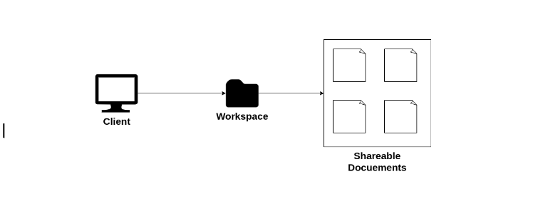
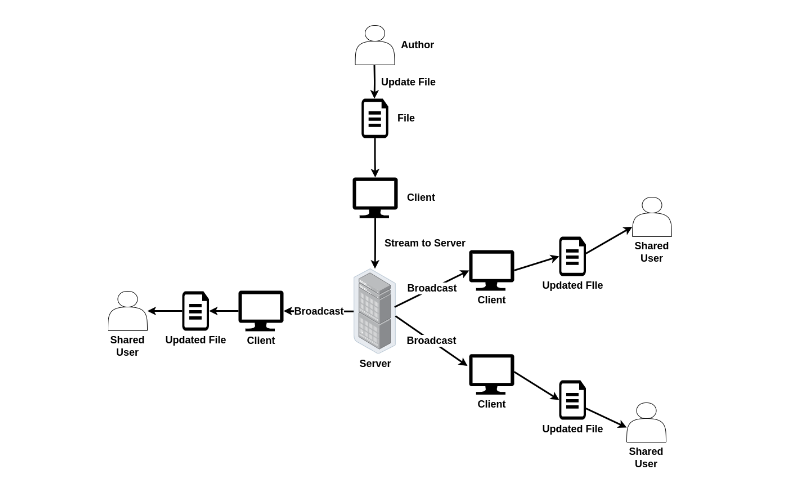
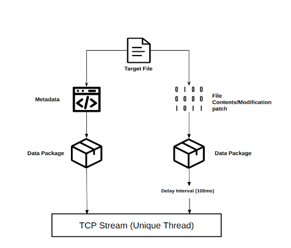
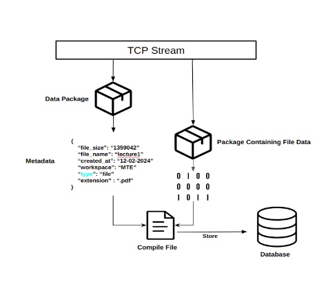
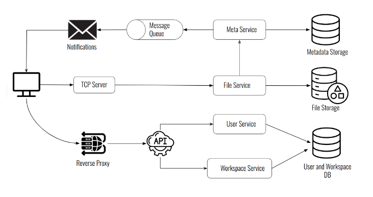

# File Synchronization System Server
Code for the backend of File Synchronization System. For the client, check [here](https://github.com/aashabtajwar/file-sync-client).

# Installation
1. Make sure to have Go in your system. You can install it from [here](https://go.dev/doc/install).
2. Clone this repository
```
git clone git@github.com:aashabtajwar/file-sync-client.git
```
3. Use `go mod tidy`. This will install necessary packages.
4. The server uses MySQL, so make sure you have it installed. Digital Ocean has a great [blog](https://www.digitalocean.com/community/tutorials/how-to-install-mysql-on-ubuntu-22-04) covering on how to install MySQL on Ubuntu 22.04. Alternatively, you can use [MariaDB](https://www.digitalocean.com/community/tutorials/how-to-install-mariadb-on-ubuntu-22-04)
5. Import SQL file `mysql -u <username> -p file-sync < filesync.sql`.
6. Use `go run main.go` or `go build main.go` with `./main` to start the server.

# System Design
**Note: The design discussed here only covers the Backend side of the application.**
The general idea is to get file synchronized across several devices in real-time. 

The system follows a client-server architecture. This architecture was used because it allows the system to consist of a centralized hub for storing and handling data. This simplifies the control of data as control logic can be more effectively implemented.


## All Modules
### System Client
This is the file system client. You can visit this repository [here](https://github.com/aashabtajwar/file-sync-client).

### Communication
Uses HTTP protocol is used to retrieve and send resources that do not require exact real-time updates. These include, but are not limited to, user registration, user login, creation of workspace, sharing a workspace, and more. TCP protocol for handling file transfers.

### UI
The client provides a graphical user interface (GUI) to allow the users to interact. A desktop application is proposed since the system requires Operating System kernel APIs and also because file operations will be done on the computers.

### File Read/ Write Operations
File reading and writing preceding and following file transfers respectively.

### Workspace Creation
The client will utilize Go language’s system libraries to directly create folders or workspaces using system calls to the Operating System. These workspaces will hold the necessary files that a user wants to share. Workspaces are created on the users’ computers as well as on the server.\


### Watcher
This is responsible for monitoring file system events. When a workspace is created, it will be under constant monitoring whenever files are created, deleted, or modified.


### Backend Servers
The backend consists of two independent server: **HTTP Server** and **TCP Server**.
- HTTP Server handles user registration, login and accessing workspace based resources. The routes are given below
    - /register, POST: Registers or creates a /user to the system
    - /login, POST: Logs in a user to the system
    - /check-token, GET: Notifies whether the token is still valid or not
    - /create-workspace, POST: Creates a new workspace entry
    - /download-workspace, POST: Downloads workspace
    - /add-user, POST: Adds a user to a workspace
    - /view-shared-workspaces, GET: See the workspaces that the user was shared with
    - /view-shared-users, GET: View all users that a workspace was shared with

- TCP Server handles file transmissions. 

## How TCP Server Recognizes Users
The HTTP server and TCP server are independent. So, even after HTTP auhentication (which is JWT based), the TCP server needs to know from which user the file transmissions are coming from. The process is done the following way:
- After HTTP authentication, send JWT token to server.
- TCP Server decodes this, and gets the user ID.
- It creates a key-value pair, the key being the connection address and the value is the user ID.
- When file transmissions are coming from this user, the server uses the connection address on the key-value pair to get the user ID.

## File Synchronization Process
At a high-level view, the synchronization process looks like this\


A workspace created by a user is constantly monitored by the "Watcher" module for creation/deletion/modification of files. Once any of these events occurs, the target file is located, and the file data and file metadata is broadcasted to all shared users.\
The ways files are dealt and synchronized is discussed below:
- Extra metadata from the file
- Extra file data
- Create a key-value paired data structure which contains file metadata and an information that tells whether a file or token will be sent. For example for files it will be "type": "file" and for tokens; "type" : "token"
- Following a 100ms delay, the file content is sent
- The server receives the file data and the metadata, and uses these to compile the file. They are also broadcasted to other users.

Figure below shows sending of file metadata and file data and sending them to TCP stream\


Figure below shows extracting of file metadata and file data at different intervals from the TCP stream \



## System Architecture



# Features
- File storage and sharing: Store files and share them with other users. This is done using workspaces.
- Real time file synchronization: Shared users will receive real-time updates whenever a file from source computer is updated. The changes are made right in to the shared users' computers. Therefore, they can view the updated versions without visiting and downloading from the browser.
- Desktop Notifications: Users get notifications whenever shared files are updated and when another user has shared a workspace.

# Further Notes
## Features to Expect in Future
The backend is incomplete and still under development. More features are underway, these include but are not limited to
- Min.io for file storage
- Giving permissions to shared users
- Conflict resolution
- Compress files before storing
- Transmit only the file changes


## 
